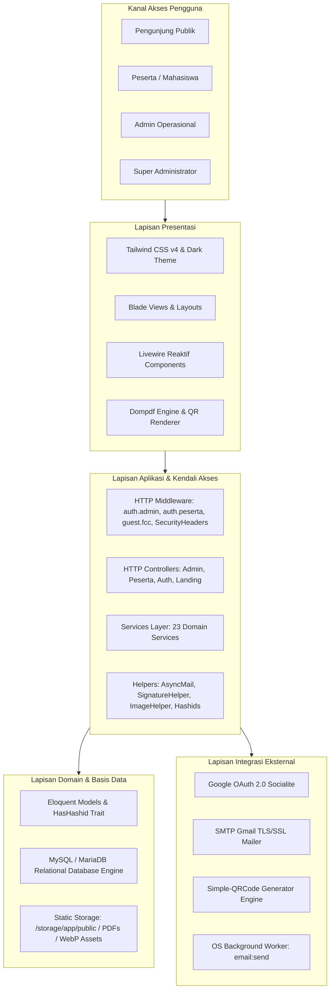
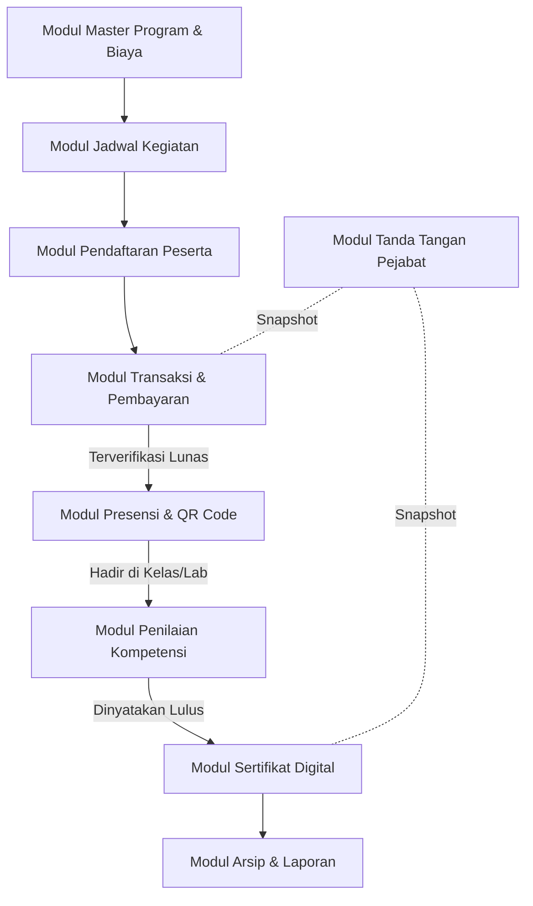
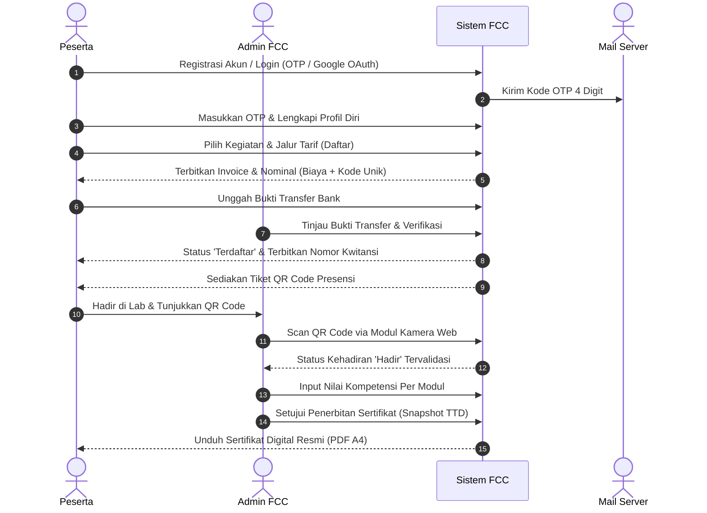
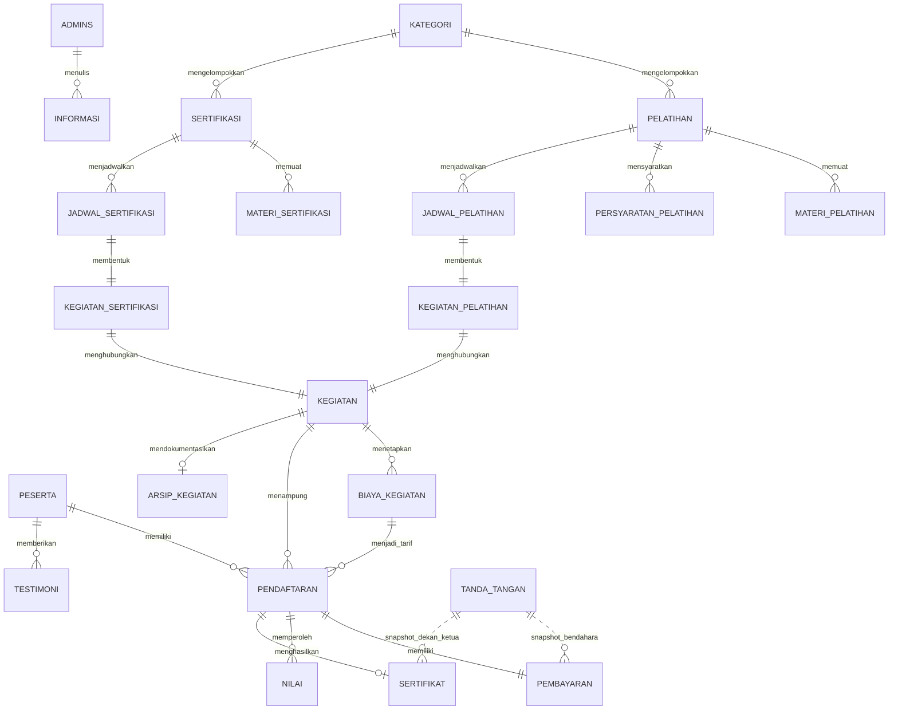
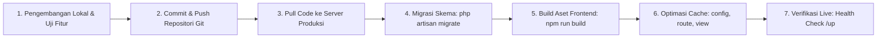

# FAKULTAS ILMU KOMPUTER
# UNIVERSITAS MUSLIM INDONESIA

---

# BLUEPRINT APLIKASI
# FIKOM CERTIFICATION CENTER (FCC) UMI

### Dokumen Pendukung Pengajuan Hak Kekayaan Intelektual
**Kategori Ciptaan: Program Komputer**

---

### Ruang Lingkup Dokumen
Blueprint ini mendeskripsikan rancangan, arsitektur, proses bisnis, struktur data, keamanan, integrasi, keluaran, dan karakteristik implementasi aplikasi web **FIKOM Certification Center (FCC) UMI** berdasarkan *source code* pada *snapshot* yang disebutkan dalam dokumen.

**Versi 1.0**  
Makassar, 2026  
*Snapshot source: commit 0d621db (2026-09-21)*

---

## Lembar Identitas Ciptaan

| Elemen | Keterangan |
| :--- | :--- |
| **Nama ciptaan** | FIKOM Certification Center (FCC) UMI |
| **Jenis ciptaan** | Program Komputer |
| **Bentuk dokumentasi** | Blueprint sistem dan deskripsi teknis-fungsional |
| **Unit pengelola** | Fakultas Ilmu Komputer, Universitas Muslim Indonesia |
| **Pencipta** | Diisi sesuai formulir dan dokumen legal pengajuan HKI |
| **Pemegang hak cipta** | Diisi sesuai keputusan dan dokumen legal institusi |
| **Alamat/negara** | Jl. Urip Sumoharjo Km. 05, Kampus II UMI, Makassar, Sulawesi Selatan, Indonesia |
| **Domain operasional** | https://iclabs.fikom.umi.ac.id/s/certification *(dan https://fcc.fikom.umi.ac.id)* |
| **Versi blueprint** | 1.0 / 2026 |
| **Basis pemeriksaan** | Snapshot source commit `0d621db`, 2026-09-21 |

### Catatan Administratif
Nama pencipta, pemegang hak, tanggal pertama kali diumumkan, tempat pertama kali diumumkan, dan nomor identitas wajib diselaraskan dengan surat pernyataan, formulir pengajuan, serta keputusan institusi. Blueprint ini tidak menetapkan kepemilikan hukum secara sepihak.

### Riwayat Dokumen

| Versi | Tanggal | Status | Keterangan |
| :---: | :---: | :---: | :--- |
| **1.0** | 25 September 2026 | Draf siap telaah | Blueprint awal berdasarkan pemeriksaan komprehensif *source code*, arsitektur, basis data, dan fungsionalitas aplikasi. |

### Pernyataan Penggunaan
Dokumen ini disusun sebagai uraian teknis-fungsional pendukung pengajuan Hak Kekayaan Intelektual untuk karya program komputer. Informasi yang disajikan berfokus pada struktur dan karakteristik sistem. Data pribadi pengguna, kredensial produksi (*API keys*, kata sandi ter-enkripsi), dan riwayat transaksi riil tidak dicantumkan demi menjaga privasi dan keamanan informasi.

---

## Daftar Isi

- [Lembar Identitas Ciptaan](#lembar-identitas-ciptaan)
- [Daftar Isi](#daftar-isi)
- [Ringkasan Eksekutif](#ringkasan-eksekutif)
- [1. Pendahuluan](#1-pendahuluan)
  - [1.1 Latar Belakang](#11-latar-belakang)
  - [1.2 Tujuan](#12-tujuan)
  - [1.3 Ruang Lingkup](#13-ruang-lingkup)
  - [1.4 Metode Penyusunan](#14-metode-penyusunan)
- [2. Identitas dan Batas Sistem](#2-identitas-dan-batas-sistem)
  - [2.1 Identitas Produk](#21-identitas-produk)
  - [2.2 Batas Sistem](#22-batas-sistem)
  - [2.3 Asumsi Operasional](#23-asumsi-operasional)
- [3. Arsitektur Aplikasi](#3-arsitektur-aplikasi)
  - [3.1 Lapisan Presentasi](#31-lapisan-presentasi)
  - [3.2 Lapisan Aplikasi](#32-lapisan-aplikasi)
  - [3.3 Lapisan Domain dan Data](#33-lapisan-domain-dan-data)
  - [3.4 Lapisan Integrasi](#34-lapisan-integrasi)
- [4. Peran dan Kendali Akses](#4-peran-dan-kendali-akses)
  - [4.1 Prinsip Otorisasi](#41-prinsip-otorisasi)
- [5. Modul Fungsional](#5-modul-fungsional)
  - [5.1 Keterhubungan Modul](#51-keterhubungan-modul)
- [6. Siklus Proses Layanan Pelatihan dan Sertifikasi](#6-siklus-proses-layanan-pelatihan-dan-sertifikasi)
- [7. Arsitektur Data](#7-arsitektur-data)
  - [7.1 Kelompok Entitas](#71-kelompok-entitas)
  - [7.2 Prinsip Integritas Data](#72-prinsip-integritas-data)
- [8. Aturan Bisnis Utama](#8-aturan-bisnis-utama)
- [9. Dokumen dan Laporan](#9-dokumen-dan-laporan)
  - [9.1 Standar Presentasi Dokumen](#91-standar-presentasi-dokumen)
- [10. Keamanan dan Privasi](#10-keamanan-dan-privasi)
  - [10.1 Risiko dan Penguatan Lanjutan](#101-risiko-dan-penguatan-lanjutan)
- [11. Integrasi Sistem](#11-integrasi-sistem)
  - [11.1 Kontrak API dan Endpoint Ringkas](#111-kontrak-api-dan-endpoint-ringkas)
- [12. Deploy dan Operasional](#12-deploy-dan-operasional)
  - [12.1 Prosedur Rilis](#121-prosedur-rilis)
  - [12.2 Backup dan Pemulihan](#122-backup-dan-pemulihan)
- [13. Pengujian dan Jaminan Mutu](#13-pengujian-dan-jaminan-mutu)
  - [13.1 Kriteria Siap Rilis](#131-kriteria-siap-rilis)
- [14. Karakteristik dan Unsur Orisinal Karya](#14-karakteristik-dan-unsur-orisinal-karya)
  - [14.1 Batas Klaim terhadap Komponen Pihak Ketiga](#141-batas-klaim-terhadap-komponen-pihak-ketiga)
- [15. Spesifikasi Teknis](#15-spesifikasi-teknis)
  - [15.1 Inventaris Source pada Snapshot](#151-inventaris-source-pada-snapshot)
- [16. Batasan dan Peta Pengembangan](#16-batasan-dan-peta-pengembangan)
- [17. Kesimpulan](#17-kesimpulan)
- [Lampiran A. Matriks Modul dan Peran](#lampiran-a-matriks-modul-dan-peran)
- [Lampiran B. Kamus Istilah](#lampiran-b-kamus-istilah)
- [Lampiran C. Daftar Kelengkapan Pengajuan HKI](#lampiran-c-daftar-kelengkapan-pengajuan-hki)
- [Lampiran D. Jejak Teknis Blueprint](#lampiran-d-jejak-teknis-blueprint)

---

## Ringkasan Eksekutif

**FIKOM Certification Center (FCC) UMI** adalah aplikasi portal terpadu berbasis web yang dirancang khusus untuk mengelola seluruh siklus operasional pelatihan keterampilan teknologi informasi dan pelaksanaan uji sertifikasi kompetensi (skala nasional maupun internasional) di lingkungan Fakultas Ilmu Komputer Universitas Muslim Indonesia. Sistem ini mengintegrasikan tahapan manajemen program, kurikulum/materi terstruktur, penjadwalan kelas, pendaftaran peserta mandiri, penerbitan invoice dengan kode verifikasi transfer unik, verifikasi berkas bukti bayar dengan kendali kedaluwarsa dinamis, presensi kehadiran nirsentuh berbasis QR Code terenkripsi token, evaluasi penilaian kompetensi per modul, hingga penerbitan sertifikat digital resmi yang dilengkapi *visual layout editor* interaktif dan tanda tangan digital terotentikasi.

Sistem membedakan hak akses dan konteks interaksi menjadi 4 (empat) entitas pengguna utama: **Super Admin**, **Admin Operasional**, **Peserta (Mahasiswa UMI & Peserta Umum)**, serta **Publik / Pengunjung Web**. Pengendalian akses dan keamanan data diimplementasikan secara ketat melalui arsitektur multi-guard Laravel, session authentication, perlindungan CSRF, throttling proteksi brute-force, HTTP Security Headers, serta penyamaran *Primary Key* database menggunakan mekanisme **Hashids** per-model untuk mencegah kerentanan manipulasi parameter URL (*Insecure Direct Object References / IDOR*).

Karakteristik utama kebaruan sistem ini terletak pada:
1. **Orkestrasi Dual-Track Terpadu:** Pengelolaan serentak untuk Program Pelatihan (*Training*) dan Uji Sertifikasi (*Certification Assessment*) di bawah satu payung entitas kegiatan (*polymorphic relation*) dengan struktur kurikulum materi dan kriteria penilaian terpisah.
2. **Otomatisasi Finansial Kode Unik:** Pembentukan nominal transfer presisi dengan prefiks penanda jenis program (digit 1 untuk pelatihan, digit 2 untuk sertifikasi) ditambah 2 digit acak unik, mencegah ambiguitas mutasi bank tanpa ketergantungan mutlak pada *payment gateway* berbiaya tinggi.
3. **Mekanisme Kedaluwarsa & Alur Perpanjangan Pembayaran:** Pengendalian otomatis batas waktu pembayaran (*expiry timer*) dengan proteksi kuota kelas, serta fasilitas pengajuan dispensasi perpanjangan waktu (*extension request*) oleh peserta yang dapat ditinjau dan disetujui admin secara fleksibel.
4. **Presensi Mandiri Terintegrasi QR Scanner:** Pemanfaatan QR token acak 32-karakter unik per pendaftaran yang dapat dipindai langsung oleh pengawas/admin melalui modul kamera terintegrasi di web browser, memvalidasi kehadiran peserta secara *real-time*.
5. **Interactive WYSIWYG Certificate Layout Editor:** Fitur perancangan tata letak sertifikat dinamis berbasis web yang memungkinkan pengelola menentukan koordinat elemen teks, ukuran font, jenis tipografi (Google Fonts), dan margin tanpa perlu mengubah kode sumber (*hardcoded*).
6. **Snapshot Tanda Tangan Pejabat Multi-Otoritas:** Penyimpanan snapshot data pejabat penandatangan (Dekan, Ketua Unit, Bendahara, Proktor Ujian) dan tanda tangan transparan pada saat sertifikat/kwitansi diterbitkan, menjamin integritas hukum dokumen historis meskipun terjadi suksesi kepengurusan di masa depan.
7. **Zero-Latency Async Mail Worker:** Pengiriman notifikasi email dan kode OTP verifikasi akun yang diproses secara asinkron di latar belakang (*background OS process*) sehingga pengguna merasakan pengalaman navigasi instan tanpa tertahan waktu koneksi SMTP (*0 ms HTTP latency*).

### Cakupan Klaim Karya
Pengajuan diarahkan pada keseluruhan *source code* aplikasi, struktur modul MVC-Service-Livewire, arsitektur basis data relasional, rancangan alur bisnis verifikasi finansial dan presensi, algoritma layouting sertifikat digital, modul pengaburan identitas data (*Hashids*), serta konfigurasi integrasi email dan otentikasi sosial yang dibangun secara spesifik untuk tata kelola FIKOM UMI. Kerangka kerja (*framework*), pustaka dependensi sumber terbuka (*open source packages*), logo institusi, serta layanan perpesanan pihak ketiga tetap tunduk pada lisensi dan hak cipta masing-masing pemilik asal.

---

## 1. Pendahuluan

### 1.1 Latar Belakang
Uji sertifikasi kompetensi keahlian dan pelatihan teknologi informasi merupakan indikator capaian standar kompetensi lulusan di Fakultas Ilmu Komputer Universitas Muslim Indonesia. Selama ini, penyelenggaraan pelatihan dan sertifikasi seringkali menghadapi kendala administratif saat dikelola melalui kanal terpisah (seperti formulir digital mandiri, komunikasi via grup pesan instan, dan pencatatan manual di lembar sebar). Hal ini memicu berbagai masalah struktural:
1. Terjadinya keterlambatan dalam rekonsiliasi konfirmasi transfer biaya pendaftaran akibat nominal yang serupa antar peserta.
2. Risiko manipulasi identitas peserta atau pengulangan registrasi yang melebihi kuota kapasitas laboratorium.
3. Kesulitan dalam pemantauan presensi kehadiran saat kegiatan berlangsung di ruang kelas/laboratorium.
4. Proses pembuatan sertifikat kelulusan yang memakan waktu panjang dan rentan terhadap kesalahan penulisan nama, nomor SK/sertifikat, atau salah peletakan posisi tanda tangan pimpinan fakultas.
5. Ketiadaan sistem arsip digital publik terpusat yang memuat berita acara, dokumentasi kegiatan, dan rekonsiliasi data lulusan yang dapat ditelusuri kembali secara akuntabel.

Untuk menjawab permasalahan tersebut, dirancanglah **FIKOM Certification Center (FCC) UMI** sebagai sistem informasi terintegrasi end-to-end yang menyatukan alur promosi program, pendaftaran online, verifikasi finansial, presensi digital, penilaian hasil uji kompetensi, dan pencetakan dokumen legal akademik ke dalam satu ekosistem berbasis web yang modern, aman, dan mudah dioperasikan.

### 1.2 Tujuan
Pembangunan sistem FCC UMI bertujuan untuk:
- Menyediakan portal terpusat (*single source of truth*) untuk seluruh program pelatihan dan sertifikasi kompetensi IT FIKOM UMI.
- Memfasilitasi pendaftaran peserta (baik civitas akademika UMI maupun masyarakat umum/profesional luar) dengan sistem autentikasi aman berbasis OTP Email dan Google OAuth.
- Mempercepat validasi transaksi pembayaran melalui sistem kode unik otomatis dan kwitansi resmi ber-snapshot tanda tangan bendahara.
- Menjamin tertib administrasi kehadiran peserta melalui lembar presensi dan pemindai QR Code nirsentuh.
- Mengotomatiskan penilaian dan penerbitan sertifikat kelulusan berbasis tata letak visual (*drag/coordinate layout editor*) dan pengamanan berkas statis PDF.
- Menyediakan transparansi publik melalui modul arsip kegiatan, dokumentasi galeri, dan unduhan berita acara resmi.
- Memberikan instrumen analitik manajerial bagi pimpinan melalui dashboard statistik, grafik tren pendaftaran, rekonsiliasi pendapatan, dan ekspor data komprehensif (Excel/CSV).

### 1.3 Ruang Lingkup
Dokumen blueprint ini mencakup:
1. Deskripsi arsitektur teknis perangkat lunak (lapisan presentasi, aplikasi, domain data, dan integrasi).
2. Tata kelola hak akses dan matriks peran pengguna (*Role-Based Access Control*).
3. Rincian 12 modul fungsional utama aplikasi dan diagram alur keterhubungannya.
4. Perancangan model basis data relasional, entitas tabel, serta integritas data.
5. Aturan bisnis inti terkait tarif bertingkat, kode unik finansial, manajemen kedaluwarsa, dan pembatalan transaksi.
6. Standar keluaran dokumen resmi (Sertifikat A4 Landscape, Kwitansi A5, Invoice Tagihan, Lembar Penilaian, Lembar Presensi).
7. Parameter keamanan siber, enkripsi kredensial, mitigasi kerentanan OWASP, dan privasi data pribadi.
8. Metodologi pengujian jaminan mutu perangkat lunak dan inventaris kode sumber pada snapshot git commit terkait.

Dokumen ini secara tegas **tidak memuat** kata sandi pengguna, data pribadi (*Personally Identifiable Information / PII*) peserta, salinan database produksi, atau rahasia kunci API (*private API keys*) pihak ketiga.

### 1.4 Metode Penyusunan
Dokumen ini disusun melalui metode analisis statis dan dinamis terhadap *source code* repositori `FikomCertificationCenter` pada commit `0d621db` (tanggal 21 September 2026). Pemeriksaan mencakup penelusuran 176+ deklarasi routing pada `routes/web.php`, 45 berkas Controller, 23 Service domain, 9 komponen reaktif Livewire, 29 Model Eloquent, 39 migrasi skema database, 7 kelas Mailable, serta verifikasi tata letak antarmuka pada 134 template Blade.

---

## 2. Identitas dan Batas Sistem

### 2.1 Identitas Produk

| Aspek | Deskripsi |
| :--- | :--- |
| **Nama Aplikasi** | FIKOM Certification Center (FCC) UMI |
| **Singkatan Resmi** | FCC UMI |
| **Kategori Produk** | Sistem Informasi Manajemen Pelatihan & Uji Sertifikasi Kompetensi |
| **Pengguna Utama** | Super Admin, Admin Panitia/Fakultas, Mahasiswa UMI, Peserta Umum/Profesional, Publik |
| **Teknologi Backend** | PHP 8.3+ (Runtime PHP 8.5.7), Framework Laravel 13.20.0 |
| **Teknologi Frontend** | Blade Templating, Livewire 4.3, Tailwind CSS 4.0, JavaScript ES6, Vite 6.2 |
| **Mesin Basis Data** | MySQL / MariaDB (Database Engine InnoDB) |
| **Mesin Dokumen & Grafis** | Barryvdh Laravel Dompdf 3.1, GD Extension (WebP Compression & PNG Alpha Stripping) |
| **Pengolahan QR & Enkripsi** | SimpleSoftwareIO Simple QRCode 4.2, Hashids 5.0 |
| **Output Utama** | Sertifikat Digital PDF, Kwitansi Pembayaran Resmi A5, Invoice Tagihan, Lembar Presensi, Laporan Rekapitulasi XLSX/CSV |
| **Lingkungan Operasional** | Server Web Linux/cPanel atau Cloud VPS berbasis HTTPS Reverse Proxy |

### 2.2 Batas Sistem
- **Di Dalam Batas Sistem (Internal):**
  - Manajemen akun pengguna, otentikasi login/registrasi, verifikasi OTP email, profil peserta.
  - Manajemen master data kategori, master program pelatihan, materi silabus, dan persyaratan.
  - Manajemen master program sertifikasi kompetensi, skema uji, dan materi ujian.
  - Pengelolaan jadwal pelaksanaan kegiatan, alokasi kuota peserta, dan penetapan varian tarif biaya.
  - Alur transaksi pendaftaran peserta, pemilihan jalur tarif (Mahasiswa/Umum), dan pembuatan kode unik.
  - Manajemen verifikasi pembayaran bank transfer manual, approval perpanjangan batas kedaluwarsa, dan pembatalan transaksi.
  - Modul pemindai QR Code presensi kehadiran nirsentuh (*real-time attendance scanner*).
  - Manajemen nilai ujian/evaluasi peserta dan kalkulasi status kelulusan.
  - Perancangan tata letak sertifikat (*visual layout editor*), penerbitan sertifikat massal/tunggal, dan penyimpanan PDF statis.
  - Penyelenggaraan konten publik (artikel berita informasi, galeri arsip, unduhan berita acara, profil instansi, formulir kontak masuk, testimoni peserta).
  - Pelaporan analitik keuangan, rekap pendaftaran, serta ekspor data ke format Excel dan CSV.

- **Di Luar Batas Sistem (Eksternal):**
  - Layanan Mail Server SMTP (Google Gmail SMTP) untuk transmisi pesan email keluar.
  - Layanan Google Identity Platform (OAuth 2.0) untuk otentikasi instan *Sign in with Google*.
  - Jaringan perbankan / aplikasi mobile banking peserta yang digunakan untuk mentransfer dana fisik.
  - Perangkat keras kamera/webcam pada gawai pengguna yang digunakan untuk membaca lembar QR Code.
  - Web browser desktop dan ponsel pintar pengunjung.

### 2.3 Asumsi Operasional
1. Seluruh peserta diasumsikan memiliki alamat email aktif yang dapat menerima pesan konfirmasi dan kode OTP numerik 4-digit dalam rentang validitas 10 menit.
2. Penyelenggara kegiatan telah menetapkan susunan pejabat penandatangan aktif (Dekan, Ketua Unit FCC, Bendahara, Proktor) dan mengunggah pindaian tanda tangan resmi berlatar transparan pada modul pengaturan tanda tangan.
3. Penetapan tarif kegiatan bersifat fleksibel: kegiatan dapat diset gratis (Rp 0) maupun berbayar dengan ragam kategori nominal (misal tarif khusus Mahasiswa FIKOM UMI versus tarif Umum).
4. Rekening bank resmi fakultas yang aktif dijadikan tujuan transfer tunggal yang ditampilkan secara otomatis pada invoice pembayaran.

---

## 3. Arsitektur Aplikasi

Aplikasi dibangun menggunakan pola arsitektur **MVC (Model-View-Controller)** yang diperkaya dengan lapisan **Service Layer** khusus untuk enkapsulasi logika bisnis lintas modul, komponen reaktif **Livewire** untuk interaksi pengguna secara *seamless*, serta **Trait HasHashid** untuk pengamanan identitas data pada URL publik.

### 3.1 Lapisan Presentasi
Antarmuka pengguna disusun menggunakan engine template **Blade** dan komponen **Livewire 4.3** dengan konsep desain estetika modern (*Neo-Brutalist Dark Theme* dengan aksen emas elegan). Karakteristik lapisan ini meliputi:
- **Komponen Dinamis Tanpa Muat Ulang Halaman:** Formulir login, pendaftaran peserta baru dengan modal verifikasi OTP, pencarian kegiatan pada katalog publik, serta filter data pembayaran di dashboard admin dioperasikan secara reaktif melalui Livewire.
- **Prinsip Responsivitas Seluler:** Navigasi bilah samping (*sidebar*), tabel data, modal konfirmasi, dan lembar kartu jadwal dirancang adaptif untuk peramban komputer desktop maupun ponsel pintar.
- **Rendering Dokumen Akurat:** Engine Dompdf dikonfigurasi pada orientasi A4 Lanskap untuk Sertifikat Kelulusan resmi, A5 Portret untuk Bukti Kwitansi Kasir, serta A4 Portret untuk Invoice dan Lembar Presensi Kehadiran.

### 3.2 Lapisan Aplikasi
Lapisan aplikasi bertindak sebagai orkestrator yang mengendalikan alur permintaan HTTP, validasi masukan (*Form Requests / Validator Rules*), dan otorisasi:
- **Pemisahan Controller dan Service:** Controller berfokus pada penerimaan HTTP request dan pemberian respon (JSON atau View), sementara aturan bisnis kompleks dipisahkan ke dalam 23 berkas Service khusus (seperti `PendaftaranService`, `PembayaranService`, `SertifikatService`, `ArsipService`, `NilaiService`).
- **Pengolahan Citra Cerdas (*ImageHelper*):** Setiap berkas foto profil peserta atau bukti bayar yang diunggah dikompresi dan dikonversi otomatis ke format modern WebP dengan ambang batas kualitas 80% dan dimensi lebar maksimal 1400px guna menghemat ruang simpan server.
- **Otomatisasi Tanda Tangan Transparan (*SignatureHelper*):** Berkas pindaian tanda tangan pejabat diproses menggunakan algoritma manipulasi piksel GD untuk mengeliminasi warna latar belakang putih (*luminance calculation*) dan menyimpannya sebagai PNG transparan ber-alpha channel halus.
- **Pemrosesan Asinkron (*AsyncMail*):** Pengiriman surat elektronik dipicu melalui proses CLI latar belakang OS (`php artisan email:send`) yang berjalan mandiri, mencegah kendala *blocking timeout* pada antarmuka web pengguna.

### 3.3 Lapisan Domain dan Data
Model Eloquent mengelola persistensi data dan relasi logika bisnis ke tabel MySQL:
- **Pencegahan Enumerasi ID (*HasHashid Trait*):** Setiap model utama (seperti `Kegiatan`, `Pendaftaran`, `Pembayaran`, `Sertifikat`, `Peserta`) mengimplementasikan *Trait HasHashid* yang menimpa fungsi *Route Model Binding* bawaan Laravel. Alih-alih menampilkan ID numerik (`/admin/kegiatan/15`), sistem mengodekannya menjadi hash alfanumerik acak berbasis salt per-model (`/admin/kegiatan/xK9mQ7zP`).
- **Integritas Relasional & Penghapusan Lunak (*Soft Deletes*):** Data peserta dan entitas krusial dilindungi menggunakan *soft deletes* (`deleted_at`), mencegah hilangnya jejak transaksi masa lalu apabila suatu entitas dihapus.

### 3.4 Lapisan Integrasi
Integrasi dirancang melalui protokol standar industri:
- **Otentikasi Google OAuth 2.0:** Menggunakan pustaka resmi Laravel Socialite untuk memvalidasi akun Gmail peserta.
- **SMTP Gateway:** Menghubungkan sistem ke server surat elektronik Gmail menggunakan enkripsi TLS/SSL pada port 465/587.
- **Mesin Generator QR Code:** Menghasilkan kode respons cepat (*Quick Response*) berformat SVG/PNG berbasis string token unik untuk validasi presensi dan keabsahan dokumen.

---

## 4. Peran dan Kendali Akses

Sistem menerapkan prinsip *Principle of Least Privilege* (Hak Akses Minimum) yang membagi kewenangan pengguna ke dalam tingkatan yang terisolasi secara ketat:

| Level | Peran | Guard | Ruang Kewenangan Utama |
| :---: | :--- | :---: | :--- |
| **1** | **Super Admin** | `admin` | Memiliki kendali mutlak atas seluruh sistem: manajemen akun Admin (tambah, sunting, hapus admin lain), konfigurasi rekening bank resmi, pengelolaan pejabat tanda tangan digital, modifikasi kategori, pemantauan log, serta seluruh hak akses level Admin operasional. |
| **2** | **Admin Operasional** | `admin` | Mengelola program pelatihan dan sertifikasi, menyusun silabus materi, menetapkan jadwal dan varian tarif, memverifikasi bukti pembayaran bank, mengelola permohonan perpanjangan waktu, melakukan pemindaian QR presensi, memasukkan nilai ujian, merancang layout sertifikat, menerbitkan sertifikat, mengelola konten publik (informasi, mitra, arsip, kontak masuk, testimoni), dan mengunduh laporan analitik. |
| **3** | **Peserta (Mahasiswa UMI)** | `peserta` | Melakukan pendaftaran kegiatan pelatihan/sertifikasi dengan memilih jalur tarif mahasiswa, mengunggah bukti transfer, memantau batas waktu pembayaran dan mengajukan permohonan perpanjangan, mengakses QR Code presensi pribadi, melihat nilai kompetensi per modul, mengunduh sertifikat digital dan invoice resmi, serta mengirimkan ulasan/testimoni kegiatan. |
| **4** | **Peserta (Umum / Profesional)** | `peserta` | Memiliki kapabilitas setara dengan peserta mahasiswa UMI, namun terikat pada ketentuan penetapan tarif umum pada kegiatan yang menetapkan diferensiasi biaya. |
| **5** | **Pengunjung Publik** | *Guest* | Menjelajahi katalog pelatihan dan sertifikasi kompetensi, mencari informasi dan berita, melihat profil FCC UMI dan daftar mitra kerja sama, menelusuri galeri arsip kegiatan terdahulu beserta unduhan lampiran berita acara, mengirim pesan lewat formulir kontak, serta memindai tautan QR verifikasi kehadiran. |

### 4.1 Prinsip Otorisasi
1. **Multi-Guard Session Authentication:** Sistem memisahkan session tabel dan provider autentikasi antara administrator (`admins`) dan peserta pelatihan (`peserta`) sehingga kedua entitas tidak dapat saling menyusup ke endpoint masing-masing.
2. **Middleware Route Protection:** Rute `/admin/*` dilindungi middleware `auth.admin`, rute `/peserta/*` dilindungi middleware `auth.peserta`, dan rute registrasi/login dikawal oleh `guest.fcc`.
3. **Pemeriksaan Super Admin Dinamis:** Fungsi penambahan akun administrator baru atau penghapusan staf dilindungi secara ketat oleh method `checkSuperAdmin()` pada controller, memastikan staf biasa menerima respon *HTTP 403 Forbidden* jika berupaya mengakses modul manajemen admin.
4. **Validasi Kepemilikan Data (*Resource Ownership*):** Peserta hanya diperkenankan melihat invoice, bukti bayar, QR presensi, dan sertifikat yang terikat langsung dengan `peserta_id` miliknya melalui pemeriksaan relasi Eloquent di sisi server.
5. **Rate Limiting & Anti Brute Force:** Endpoint sensitif seperti submit login dan permintaan OTP dibatasi secara ketat menggunakan throttle limiter (maksimal 10 request per menit untuk login/registrasi dan 5 request per menit untuk kirim ulang OTP).

---

## 5. Modul Fungsional

| Modul | Fungsi Utama |
| :--- | :--- |
| **Autentikasi & Akun** | Login dan registrasi modal multi-role, verifikasi pendaftaran akun via kode OTP email 4 digit (10 menit masa aktif), integrasi *Sign in with Google OAuth*, alur lupa password dengan reset OTP, serta penonaktifan akun oleh administrator. |
| **Profil & Kelengkapan Data** | Pembaruan informasi diri peserta (Nama, NIK/NIM, Jenis Kelamin, No. HP, Instansi, Pekerjaan, Alamat), unggah foto profil terkompresi WebP, serta alur pengubahan alamat email terkonfirmasi OTP. |
| **Program Pelatihan** | Manajemen master pelatihan IT, penentuan kode program, deskripsi silabus, tautan materi cloud, penugasan kategori keahlian, struktur persyaratan peserta, dan relasi prasyarat (*prerequisite course*). |
| **Program Sertifikasi** | Manajemen master sertifikasi kompetensi (nasional/internasional), penentuan kode sertifikasi, modul uji kompetensi, tautan referensi soal/materi, dan kategorisasi keahlian. |
| **Jadwal & Penetapan Biaya** | Penjadwalan tanggal batas pendaftaran, tanggal pelaksanaan, rentang jam kelas, batas kuota peserta, dan penentuan varian skema tarif (*multiple biaya* per kegiatan: gratis, khusus mahasiswa, atau umum). |
| **Pendaftaran & Transaksi** | Pendaftaran mandiri kegiatan, kalkulasi nominal transfer dengan kode unik 3-digit terstandarisasi, pembuatan invoice pembayaran resmi, dan pemantauan hitung mundur kedaluwarsa pembayaran. |
| **Verifikasi Finansial** | Pemeriksaan mutasi bukti transfer oleh admin, validasi nomor referensi transfer, persetujuan/penolakan pembayaran, penerbitan nomor kwitansi urut otomatis, serta alur persetujuan perpanjangan tenggat bayar. |
| **Presensi & QR Code** | Penerbitan QR token 32 karakter unik per pendaftaran, lembar cetak presensi massal, tampilan kartu QR peserta, dan modul pemindai kamera (*scanner web*) untuk verifikasi status kehadiran instan. |
| **Penilaian Kompetensi** | Pengisian nilai evaluasi per modul silabus materi (skala 0.00 – 100.00), catatan evaluasi instruktur/penguji, dan penentuan kualifikasi kelulusan peserta. |
| **Sertifikat Digital** | Pembuat layout sertifikat visual interaktif (*interactive coordinate editor*), unggah latar belakang sertifikat khusus, rendering dokumen PDF ukuran A4 landscape, serta penyimpanan dokumen statis pre-rendered. |
| **Manajemen Pejabat Tanda Tangan** | Pengelolaan profil 4 otoritas penandatangan (Dekan, Ketua Unit, Bendahara, Proktor Ujian), unggah pindaian tanda tangan dengan penghapusan latar belakang putih otomatis, dan pencatatan snapshot tanda tangan pada dokumen transaksi. |
| **Publikasi & Arsip** | Pengelolaan artikel pengumuman informasi (*tayang/draf*), manajemen logo mitra kerja sama, arsip kegiatan terdahulu beserta galeri dokumentasi dan berita acara PDF, formulir kontak masuk, serta ulasan testimoni peserta. |

### 5.1 Keterhubungan Modul
Seluruh modul dirancang terhubung secara berkesinambungan:
1. Pendaftaran hanya dapat dibuka jika jadwal kegiatan telah dipublikasikan dan kuota peserta belum terpenuhi.
2. Status pembayaran yang berstatus `terverifikasi` secara otomatis mengaktifkan status pendaftaran menjadi `terdaftar`, yang kemudian membangkitkan `qr_token` kehadiran.
3. Hak input nilai kompetensi dan penerbitan sertifikat kelulusan hanya diberikan kepada peserta yang berstatus `terdaftar` dan telah terekam kehadirannya pada modul presensi.
4. Saat kwitansi atau sertifikat diterbitkan, sistem menyematkan snapshot data pejabat penandatangan aktif dari modul tanda tangan, mengunci keabsahan dokumen terhadap perubahan struktural di masa depan.

---

## 6. Siklus Proses Layanan Pelatihan dan Sertifikasi

| Tahap | Proses | Kendali Utama di Sisi Sistem |
| :---: | :--- | :--- |
| **1** | **Autentikasi & Verifikasi Akun** | Pembuatan akun dikunci menggunakan verifikasi email OTP 4 digit atau akun Google OAuth; profil dasar wajib diisi lengkap sebelum mendaftar program. |
| **2** | **Eksplorasi & Pemilihan Program** | Peserta memilih pelatihan atau sertifikasi; sistem memvalidasi ketersediaan jadwal, status publikasi (*public*), batas tanggal pendaftaran, dan sisa kuota bangku. |
| **3** | **Registrasi Kegiatan & Penetapan Tarif** | Peserta memilih jenis biaya yang sesuai (Mahasiswa/Umum); sistem membuat entitas pendaftaran dengan status `menunggu_pembayaran`. |
| **4** | **Penerbitan Invoice & Kode Unik** | Sistem menghitung nominal transfer presisi (`jumlah_bayar` + `kode_unik` 3 digit) dan menetapkan tenggat kedaluwarsa pembayaran. |
| **5** | **Pembayaran & Verifikasi Admin** | Peserta mengunggah pindaian resi bank; Admin memvalidasi keaslian mutasi; saat disetujui, sistem membangkitkan nomor kwitansi resmi (`KWT/FCC/YYYYMM/XXXX`) ber-snapshot tanda tangan bendahara. |
| **6** | **Penerbitan QR Presensi** | Sistem otomatis menghasilkan string `qr_token` 32 karakter acak yang dapat diakses peserta pada antarmuka dashboard atau dicetak dalam format kartu tanda peserta. |
| **7** | **Pelaksanaan Kelas & Presensi QR** | Pengawas memindai QR Code peserta menggunakan kamera browser; sistem secara instan memvalidasi status pendaftaran dan mengubah status kehadiran menjadi `hadir`. |
| **8** | **Uji Kompetensi & Penilaian** | Instruktur menginput perolehan skor numerik untuk setiap materi kurikulum; sistem mengalkulasi capaian rata-rata dan status kelulusan. |
| **9** | **Penerbitan Sertifikat & Pengarsipan** | Admin menyetujui penerbitan sertifikat; sistem mencetak nomor sertifikat unik (`CERT/YYYY/KegiatanID/PendaftaranID`), menyematkan snapshot tanda tangan Dekan & Ketua Unit, merender berkas PDF statis, dan mengarsipkan data kegiatan. |

---

## 7. Arsitektur Data

Basis data dirancang menggunakan mesin penyimpanan relasional **MySQL/MariaDB (InnoDB)** yang menjamin kepatuhan sifat *Atomicity, Consistency, Isolation, and Durability (ACID)* pada seluruh transaksi finansial dan data kelulusan.

### 7.1 Kelompok Entitas

| Kelompok | Contoh Entitas Utama | Informasi yang Dikelola |
| :--- | :--- | :--- |
| **Identitas & Otorisasi** | `admins`, `peserta`, `otp_codes`, `password_reset_tokens` | Kredensial akun, status peran (*super_admin/admin*), biodata lengkap peserta, email tertunda, token OTP sementara, batas kedaluwarsa OTP. |
| **Master Program & Kurikulum** | `kategori`, `pelatihan`, `sertifikasi`, `materi_pelatihan`, `materi_sertifikasi`, `persyaratan_pelatihan` | Klasifikasi keahlian, kode program, judul, silabus materi terurut, prasyarat keilmuan, dan referensi tautan sumber ajar. |
| **Jadwal & Penyelenggaraan** | `jadwal_pelatihan`, `jadwal_sertifikasi`, `kegiatan`, `kegiatan_pelatihan`, `kegiatan_sertifikasi`, `biaya_kegiatan` | Waktu pendaftaran, tanggal pelaksanaan kegiatan, jam kelas, kuota peserta, pengaturan multi-tarif biaya, latar sertifikat, dan koordinat tata letak teks sertifikat. |
| **Pendaftaran & Finansial** | `pendaftaran`, `pembayaran`, `rekening` | Data relasi peserta dan kegiatan, kode pembayaran unik, nominal bayar, kode unik transfer 3 digit, tanggal kedaluwarsa bayar, bukti transfer bank, nomor kwitansi, serta jejak permohonan perpanjangan waktu. |
| **Presensi & Evaluasi** | `pendaftaran` (kolom `qr_token`, `status_kehadiran`), `nilai` | Token pemindai presensi 32 karakter, status kehadiran kelas, perolehan nilai numerik per materi modul, dan catatan deskriptif kelulusan. |
| **Legalisasi & Sertifikat** | `sertifikat`, `tanda_tangan` | Nomor sertifikat unik terstandarisasi, berkas PDF statis tersimpan, tanggal terbit, serta data historis nama, jabatan, NIP, dan pindaian tanda tangan 4 pejabat berwenang. |
| **Konten Publik & Dukungan** | `informasi`, `arsip_kegiatan`, `mitra`, `kontak`, `konten_halaman`, `pesan_masuk`, `testimoni` | Artikel warta, unduhan berkas PDF berita acara dan dokumentasi galeri, data kontak sekretariat, pesan pengaduan publik, dan bintang ulasan peserta. |

### 7.2 Prinsip Integritas Data
1. **Primary Key Masking:** Seluruh tabel transaksi dan referensi publik mengadopsi trait `HasHashid` sehingga kunci primer integer internal (`id`) tidak pernah diekspos secara mentah ke browser.
2. **Kekedapan Dokumen Historis (*Data Immutability*):** Dokumen sertifikat dan kwitansi menyimpan `ttd_snapshot` berupa struktur JSON berisi profil pejabat pada saat dokumen disahkan. Perubahan nama dekan atau bendahara di kemudian hari tidak akan memanipulasi dokumen yang telah diterbitkan sebelumnya.
3. **Pemberian Kode Unik Berbasis Prefiks:** Logika pembuatan `kode_unik` 3 digit menjamin tidak ada duplikasi nominal transfer pada hari yang sama antara program pelatihan dan uji sertifikasi.
4. **Restriksi Kuota & Integritas Status:** Sistem membatasi pendaftaran berstatus valid (`menunggu_pembayaran`, `menunggu_verifikasi`, `terdaftar`) tidak melampaui kolom `kuota_peserta` pada jadwal yang ditetapkan.

---

## 8. Aturan Bisnis Utama

| Area | Aturan Implementasi Sistem |
| :--- | :--- |
| **Verifikasi Akun OTP** | Pendaftaran peserta baru wajib melalui verifikasi kode OTP 4-digit yang dikirim ke email terdaftar. Kode berlaku selama 10 menit dan hanya dapat digunakan 1 kali (*single-use*). |
| **Profil Lengkap Peserta** | Peserta tidak dapat mendaftar kegiatan sebelum melengkapi 5 kolom identitas wajib: Nama Lengkap, Nomor HP/WhatsApp, Alamat Email, Instansi Asal, dan Pekerjaan/Profesi. |
| **Pembedaan Tarif Biaya** | Satu kegiatan dapat memiliki lebih dari satu pilihan tarif (misal: Gratis Rp 0, Mahasiswa UMI Rp 150.000, Umum Rp 300.000). Peserta wajib memilih satu jenis biaya saat mendaftar. |
| **Algoritma Kode Unik Finansial** | Nominal yang harus dibayar peserta ditambahkan kode unik 3 digit: digit pertama melambangkan jenis program (1 = Pelatihan, 2 = Sertifikasi), digit ke-2 dan ke-3 berupa angka acak 10–99. Total transfer = `biaya` + `kode_unik`. |
| **Batas Waktu Pembayaran** | Pembayaran memiliki waktu tenggat kedaluwarsa (*expiry*). Apabila melewati batas waktu tanpa unggah bukti transfer, status transaksi berubah otomatis menjadi `kadaluarsa` dan kuota bangku dilepaskan kembali ke publik. |
| **Dispensasi Perpanjangan Tenggat** | Peserta yang transaksinya mendekati tenggat atau telah kedaluwarsa berhak mengajukan permohonan perpanjangan waktu dengan menyertakan alasan. Admin dapat menyetujui perpanjangan (tambahan waktu +2 jam) atau menolaknya. |
| **Penerbitan Nomor Kwitansi** | Kwitansi diterbitkan otomatis saat admin memverifikasi pembayaran dengan pola penomoran: `KWT/FCC/YYYYMM/XXXX` (nomor urut 4 digit per bulan berjalan). |
| **Validasi Presensi QR Code** | QR token hanya dapat dipindai oleh sistem jika pendaftaran berstatus `terdaftar` (lunas/gratis). Token yang sudah berstatus `hadir` akan ditolak dengan pesan peringatan ganda (*already scanned*). |
| **Struktur Nomor Sertifikat** | Nomor sertifikat diterbitkan menggunakan format baku: `CERT/{Tahun}/{KegiatanID_4digit}/{PendaftaranID_6digit}` (contoh: `CERT/2026/0004/000012`). |
| **Pre-Rendered Storage Serving** | Sertifikat yang telah disetujui admin langsung dirender dan disimpan dalam bentuk berkas PDF fisik di direktori statis penyimpanan. Permintaan unduhan berikutnya langsung menyajikan berkas fisik tersebut (*0 ms re-rendering overhead*). |

---

## 9. Dokumen dan Laporan

| Keluaran | Format | Karakteristik Tata Letak & Kendali Data |
| :--- | :---: | :--- |
| **Sertifikat Kompetensi Digital** | PDF | Kertas A4 Landscape; latar belakang grafis resolusi tinggi; tipografi bersumber dari Google Fonts; nomor sertifikat unik; snapshot nama/NIP/tanda tangan transparan Dekan dan Ketua Unit; QR Code keabsahan berkas. |
| **Kwitansi Pembayaran Resmi** | PDF | Kertas A5 Portret; memuat identitas peserta, rincian biaya kegiatan, kode unik, nomor kwitansi urut bulanan, stempel/tanda tangan bendahara kasir, dan tanggal verifikasi lunas. |
| **Invoice Tagihan Pendaftaran** | PDF | Kertas A4 Portret; memuat petunjuk transfer antar-bank, nomor rekening resmi fakultas, instruksi penulisan berita transfer, nominal eksak hingga 3 digit terakhir, dan batas waktu kedaluwarsa. |
| **Lembar Presensi Peserta** | PDF & Cetak | Kertas A4 Landscape; daftar nama peserta terdaftar, instansi, kolom tanda tangan manual cadangan, rekapitulasi waktu pemindaian QR presensi. |
| **Lembar Penilaian Hasil Uji** | PDF & Cetak | Kertas A4 Portret; tabel rincian modul silabus materi, skor capaian per modul, nilai akhir terbobot, serta tanda tangan verifikasi instruktur/proktor. |
| **Lembar QR Presensi Massal** | Cetak / Web | Lembar cetak kumpulan kartu QR Code peserta untuk keperluan registrasi meja depan (*front-desk badge printing*). |
| **Berita Acara Arsip Kegiatan** | PDF | Berkas resmi berita acara pelaksanaan kegiatan, laporan ringkasan, daftar instruktur pelaksana, dan galeri dokumentasi foto kegiatan untuk pelaporan fakultas. |
| **Rekapitulasi Keuangan & Peserta** | XLSX / CSV | Laporan komprehensif bulanan/tahunan: data pendaftar, pendapatan bruto, persentase konversi verifikasi, rata-rata transaksi, dan distribusi instansi asal peserta. |

### 9.1 Standar Presentasi Dokumen
- Standar dokumen resmi menggunakan konfigurasi margin terkontrol dan isolasi tata letak agar tidak terpotong antar halaman (*page break safety*).
- Berkas tanda tangan digital disanitasi secara otomatis sehingga tidak menyisakan artefak kotak putih kotor yang menutupi garis teks nama atau jabatan pejabat.
- Setiap sertifikat PDF yang dihasilkan dijamin konsistensi visualnya melalui pengujian *rendering engine* Dompdf dengan integrasi font berbasis CSS *inline font-face*.

---

## 10. Keamanan dan Privasi

| Kontrol Keamanan | Implementasi Teknis pada Aplikasi |
| :--- | :--- |
| **Otentikasi Multi-Guard** | Pemisahan total antara guard `admin` dan `peserta` menggunakan Session Driver database/cookie terisolasi, mencegah peningkatan hak akses (*privilege escalation*). |
| **Mitigasi Serangan IDOR** | Implementasi *Trait HasHashid* pada seluruh model utama. Seluruh ID numerik database disandikan menjadi string alfanumerik acak dengan salt unik per-model (URL publik tidak mengekspos ID asli). |
| **Proteksi Nilai Rahasia (*Credentials*)** | Kunci rahasia Google Client Secret, kata sandi SMTP, dan Application Key disimpan pada file konfigurasi `.env` dan tidak pernah dimasukkan ke dalam commit repositori publik. |
| **Proteksi Masukan & CSRF** | Seluruh formulir POST/PUT/DELETE dilindungi oleh token CSRF bawaan Laravel dan divalidasi ketat melalui aturan *Form Request* dan *Custom Validation Rules* (misal: `ValidEmailAddress`, `UniqueEmailAcrossRoles`). |
| **HTTP Security Headers** | Middleware `SecurityHeaders` menyuntikkan header perlindungan peramban: `X-Frame-Options: SAMEORIGIN` (anti-clickjacking), `X-Content-Type-Options: nosniff` (anti-MIME sniffing), `X-XSS-Protection: 1; mode=block`, dan `Referrer-Policy: strict-origin-when-cross-origin`. |
| **Enkripsi Kata Sandi** | Sandi pengguna di-hash menggunakan algoritma modern standar industri (**Bcrypt** dengan work factor 12) yang tahan terhadap serangan kamus (*rainbow tables*). |
| **Sanitasi Berkas Unggahan** | Pemeriksaan tipe MIME ketat pada unggahan foto dan bukti transfer, diiringi konversi format instan ke WebP murni untuk melucuti potensi muatan berbahaya (*malicious script payload in image metadata/EXIF*). |
| **Throttling & Anti-Spam** | Pembatasan frekuensi pengiriman request (10 request/menit untuk login dan 5 request/menit untuk pengiriman ulang OTP) guna menangkal serangan *Brute-Force* dan *Denial of Service (DoS)*. |

### 10.1 Risiko dan Penguatan Lanjutan

| Area Risiko | Dampak Potensial | Rekomendasi Mitigasi Teknis |
| :--- | :--- | :--- |
| **Penyalahgunaan Akun Admin** | Modifikasi data sertifikat atau persetujuan pembayaran fiktif | Penerapan *Multi-Factor Authentication (MFA / 2FA)* berbasis aplikasi TOTP (Google Authenticator) untuk seluruh akun admin. |
| **Ketergantungan Eksternal SMTP** | Tertundanya pengiriman kode OTP pendaftaran jika server email Google mengalami throttling | Penambahan gerbang SMS/WhatsApp Gateway cadangan sebagai alternatif kanal verifikasi OTP. |
| **Eksploitasi Tautan Unduhan** | Pengunduhan berkas sertifikat milik orang lain secara masif | Penyematan tanda tangan URL (*Signed URL*) bertenggat waktu untuk setiap tautan unduhan dokumen PDF privat. |
| **Kehilangan Data Server** | Kerusakan piringan keras server atau kegagalan sistem cPanel | Penjadwalan pencadangan otomatis harian (*automated off-site backup*) ke media penyimpanan cloud terpisah (Amazon S3 / Google Cloud Storage). |

---

## 11. Integrasi Sistem

| Integrasi | Pola Komunikasi | Fungsi & Parameter Kendali |
| :--- | :---: | :--- |
| **Google OAuth 2.0 (Socialite)** | Server-to-Server via HTTPS Redirect | Otentikasi masuk cepat bagi peserta tanpa registrasi formulir manual; memetakan identitas nama lengkap, email terverifikasi Google, dan foto avatar. |
| **SMTP Mail Gateway** | Protokol SMTP over SSL/TLS | Pengiriman kode OTP pendaftaran, notifikasi status pembayaran terverifikasi/ditolak, serta konfirmasi persetujuan perpanjangan waktu. |
| **Mesin Generator QR Code** | Pustaka Internal (Bacon/SimpleQRCode) | Pembentukan matriks QR Code secara lokal tanpa memanggil API pihak ketiga publik, menjamin kecepatan rendering dan kerahasiaan token. |
| **Mesin Render Dompdf** | Pustaka Internal PHP | Kompilasi template HTML/Blade menjadi dokumen PDF resmi secara lokal dengan opsi pemuatan aset gambar lokal berkecepatan tinggi. |
| **Penyimpanan Berkas Statis** | Local Filesystem / Symlink Storage | Manajemen berkas publik dan dokumen unduhan melalui symlink `storage/app/public` ke `public/storage`. |
| **OS Background Dispatcher** | Asynchronous CLI Execution | Pemanggilan perintah artisan `email:send` secara mandiri di latar belakang OS (Windows `start /B` atau Linux `exec &`) dengan latensi 0 ms. |

### 11.1 Kontrak API dan Endpoint Ringkas

| Metode | Endpoint Rute | Fungsi dan Sasaran Respon |
| :---: | :--- | :--- |
| `GET` | `/api/search?q={keyword}` | Pencarian cepat kegiatan pelatihan/sertifikasi untuk komponen autocomplete publik (JSON). |
| `GET` | `/qr/scan/{token}` | Endpoint publik validasi presensi instan via pembacaan QR Code kamera. |
| `GET` | `/admin/api/chart/pendapatan` | Data agregat penerimaan dana bulanan/tahunan untuk grafik dashboard admin (JSON). |
| `GET` | `/admin/api/chart/pendaftaran` | Statistik tren volume pendaftaran peserta per periode waktu (JSON). |
| `GET` | `/admin/api/chart/kegiatan` | Distribusi proporsi kegiatan pelatihan versus sertifikasi kompetensi (JSON). |
| `GET` | `/admin/api/calendar` | Jadwal kalender operasional kegiatan untuk visualisasi agenda admin (JSON). |
| `GET` | `/peserta/api/chart/aktivitas` | Ringkasan grafik riwayat partisipasi dan capaian kegiatan peserta personal (JSON). |

---

## 12. Deploy dan Operasional

### 12.1 Prosedur Rilis
1. **Pengembangan & Pemeriksaan Lokal:** Seluruh penambahan fitur dan perbaikan bug dikembangkan di lingkungan lokal serta diverifikasi integritas fungsionalnya.
2. **Pengujian Kode Sumber:** Menjalankan pengujian regresi dan pembersihan kode (*code linting*) sebelum melakukan commit.
3. **Penyimpanan Versi Git:** Setiap perubahan di-commit dengan deskripsi pekerjaan yang jelas dan terstruktur.
4. **Pembaruan Berkas Server:** Penarikan perubahan pada server produksi menggunakan Git tanpa menimpa direktori data unggahan pengguna (`storage/app/public`).
5. **Migrasi Basis Data:** Menjalankan perintah migrasi skema `php artisan migrate --force` jika terdapat berkas migrasi baru.
6. **Kompilasi Aset Produksi:** Menjalankan perintah `npm run build` menggunakan Vite untuk menghasilkan berkas CSS dan JavaScript terkompresi.
7. **Penyegaran Cache Framework:** Menjalankan pembersihan dan pembaruan cache aplikasi:
   - `php artisan config:cache`
   - `php artisan route:cache`
   - `php artisan view:cache`
8. **Verifikasi Operasional:** Memeriksa ketersediaan sistem melalui rute health check `/up` serta melakukan pengujian alur kritis (login, pencetakan invoice, dan download sertifikat).

### 12.2 Backup dan Pemulihan
- **Basis Data:** Pencadangan dump SQL basis data produksi dilakukan secara berkala dan diarsipkan secara terkompresi.
- **Berkas Statis Unggahan:** Direktori `storage/app/public` (berisi foto peserta, latar sertifikat, resi pembayaran, dan tanda tangan) wajib dicadangkan secara rutin bersamaan dengan dump database.
- **Prosedur Pemulihan (*Disaster Recovery*):** Dalam kondisi darurat, pemulihan dilakukan dengan mengimpor dump SQL terakhir, merekonstruksi tautan simbolik `php artisan storage:link`, dan memeriksa kesesuaian kunci aplikasi `APP_KEY`.

---

## 13. Pengujian dan Jaminan Mutu

Pemeriksaan komprehensif terhadap repositori `FikomCertificationCenter` mencakup pengujian unit/fitur otomatis, penelusuran konsistensi antarmuka pengguna, serta pengujian logika transaksi finansial.

| Jenis Pemeriksaan | Cakupan & Fokus Pengujian |
| :--- | :--- |
| **Unit & Feature Test** | Pengujian logika otentikasi multi-guard, validasi format email khusus, kalkulasi kode unik, alur kedaluwarsa pembayaran, dan fungsi encoding/decoding Hashids. |
| **User Acceptance Testing (UAT)** | Simulasi skenario alur nyata dari perspektif Peserta Mahasiswa UMI, Peserta Umum, Admin Operasional, dan Super Administrator. |
| **Visual & Layout QA** | Responsivitas tema antarmuka (*Dark/Gold aesthetics*), fleksibilitas sidebar navigasi pada perangkat layar sentuh, modal popup Livewire, dan kejelasan kontras teks. |
| **Document Rendering QA** | Uji cetak berkas PDF Sertifikat A4 Landscape pada ragam panjang nama peserta, uji cetak Kwitansi A5, Invoice Tagihan, serta Lembar Presensi Kehadiran. |
| **Security & Penetration Test** | Uji ketahanan terhadap manipulasi ID URL (*IDOR parameter tampering*), serangan CSRF pada seluruh form, SQL Injection melalui ORM Eloquent, dan upaya pemalsuan QR token presensi. |
| **Production Smoke Test** | Verifikasi koneksi SSL HTTPS, kelancaran pengiriman email via Gmail SMTP, pemuatan gambar latar sertifikat statis, dan ekspor lembar kerja Excel. |

### 13.1 Kriteria Siap Rilis
- Seluruh rute administratif dan publik merespon sesuai kode status HTTP yang diharapkan tanpa pesan *error 500*.
- Tidak terjadi kegagalan rendering (*fatal error*) pada mesin Dompdf saat memproses karakter khusus atau nama panjang.
- Migrasi database berjalan secara bersih (*clean migration*) tanpa anomali relasi kunci asing (*foreign key constraints*).
- Seluruh data rahasia (*environment secrets*) terisolasi secara sempurna dari paparan publik.

---

## 14. Karakteristik dan Unsur Orisinal Karya

Unsur orisinal karya yang diajukan pada pencatatan hak cipta program komputer ini terletak pada rancang bangun logika bisnis, arsitektur integrasi modul, dan pemilihan solusi perangkat lunak yang dikembangkan secara spesifik untuk memfasilitasi kebutuhan Pusat Sertifikasi Fakultas Ilmu Komputer UMI:

| Karakteristik | Implementasi Khas pada FIKOM Certification Center |
| :--- | :--- |
| **Orkestrasi Dual-Track Terpadu** | Penyatuan manajemen program Pelatihan IT (*Training*) dan Sertifikasi Keahlian (*Certification*) ke dalam struktur kegiatan polimorfik terpadu dengan penanganan silabus materi dan penilaian yang fleksibel. |
| **Penetapan Varian Tarif Dinamis** | Fasilitas penentuan skema multi-biaya per kegiatan (biaya gratis, tarif mahasiswa, atau tarif umum) yang terikat langsung pada alur pemilihan pendaftaran peserta. |
| **Automasi Kode Unik Berprefiks** | Algoritma penambahan 3 digit kode unik pada nominal transfer bank dengan digit pembeda jenis program (1=Pelatihan, 2=Sertifikasi) guna mempermudah rekonsiliasi mutasi manual tanpa bergantung pada vendor gerbang pembayaran eksternal. |
| **Siklus Dispensasi Pembayaran** | Mekanisme hitung mundur kedaluwarsa (*expiry countdown timer*) yang dilengkapi alur pengajuan perpanjangan waktu pembayaran oleh peserta dan tombol persetujuan cepat oleh admin. |
| **Presensi Instan Berbasis QR Token** | Penggunaan token acak 32-karakter unik per pendaftar yang dapat diverifikasi secara instan menggunakan modul kamera web terintegrasi di peramban, mencegah duplikasi absensi. |
| **Interactive Certificate Layout Editor** | Modul perancang tata letak sertifikat berbasis web yang memungkinkan administrator mengatur posisi koordinat teks (*top/left/right*), jenis huruf Google Fonts, ukuran, dan jarak baris secara visual. |
| **Snapshot Tanda Tangan 4 Pejabat** | Mekanisme penguncian data pejabat (Dekan, Ketua Unit, Bendahara, Proktor) dan pindaian tanda tangan transparan pada saat sertifikat dan kwitansi diterbitkan guna menjaga orisinalitas dokumen historis. |
| **Mitigasi IDOR via Per-Model Hashids** | Pengaburan ID numerik tabel basis data pada seluruh tautan publik menggunakan algoritma Hashids dengan salt berbeda pada setiap model Eloquent. |
| **Otomatisasi Kompresi WebP & Alpha Stripping** | Transformasi otomatis seluruh unggahan foto menjadi format modern WebP serta algoritma pembersih latar belakang putih tanda tangan menjadi PNG transparan berbasis analisis luminansi piksel. |
| **Zero-Latency Async Mail Worker** | Pola eksekusi asinkron pengiriman email OTP dan notifikasi ke proses background sistem operasi, menjaga respon antarmuka pengguna tetap berada pada level *0 ms latency*. |

### 14.1 Batas Klaim terhadap Komponen Pihak Ketiga

| Komponen | Lisensi | Batas Klaim |
| :--- | :---: | :--- |
| **Laravel Framework v13.20.0** | MIT | Kerangka kerja dasar aplikasi; bukan merupakan klaim ciptaan eksklusif pemohon. |
| **Livewire v4.3** | MIT | Pustaka reaktivitas komponen antarmuka; logika interaksi dan alur data modal pendaftaran merupakan bagian implementasi karya. |
| **Tailwind CSS v4.0** | MIT | Framework utilitas CSS; komposisi desain tema gelap (*dark theme*) dan tata letak halaman merupakan karya perancang sistem. |
| **Barryvdh Laravel Dompdf** | LGPL / MIT | Mesin pengubah HTML ke PDF; struktur template dokumen resmi, CSS tata letak, dan kalkulasi koordinat sertifikat merupakan implementasi karya. |
| **Simple Software IO Simple-QRCode** | MIT | Mesin pembuat matriks QR Code; arsitektur tokenisasi presensi dan alur verifikasi merupakan implementasi ciptaan. |
| **Hashids for PHP** | MIT | Pustaka algoritma pengacakan ID; konfigurasi salt per-model dan pengikatan ke model binding merupakan bagian implementasi sistem. |
| **Google Identity Platform (Socialite)** | Layanan Eksternal | Layanan otentikasi Google; bukan bagian source code yang diklaim, melainkan jembatan konektor integrasi yang dikembangkan. |
| **Identitas Visual & Logo FIKOM UMI** | Hak Institusi | Digunakan berdasarkan penugasan resmi institusi; hak atas logo dan nama institusi tetap berada pada Universitas Muslim Indonesia. |

---

## 15. Spesifikasi Teknis

| Komponen | Spesifikasi Teknis |
| :--- | :--- |
| **Bahasa Pemrograman** | PHP 8.3+ (Runtime lingkungan pemeriksaan: PHP 8.5.7 x64) |
| **Framework Backend** | Laravel Framework versi 13.20.0 |
| **Komponen Reaktif** | Livewire versi 4.3 |
| **Sistem Basis Data** | MySQL versi 8.0+ / MariaDB versi 10.4+ |
| **Teknologi Frontend** | Blade Templates, Tailwind CSS 4.0, Vite 6.2, Alpine.js, JavaScript ES6 |
| **Manipulasi Grafis & Gambar** | PHP GD Extension (WebP encoder, Alpha Channel Image Processor) |
| **Mesin Dokumen & QR** | Dompdf 3.1, Bacon QR Code / Simple-QRCode 4.2 |
| **Pengolahan Spreadsheet** | Maatwebsite Laravel Excel 3.1 & Native Streamed CSV Handler |
| **Protokol Keamanan** | SSL/TLS HTTPS, CSRF Token Protection, Bcrypt Password Hashing, HTTP Security Headers |
| **Kebutuhan Server** | Web Server Nginx / Apache, PHP-FPM, cPanel Hosting / Cloud VPS, Crontab / Task Scheduler |
| **Dukungan Klien** | Web Browser modern (Google Chrome, Mozilla Firefox, Microsoft Edge, Safari) pada perangkat desktop dan mobile |

### 15.1 Inventaris Source pada Snapshot

| Artefak Sistem | Jumlah Riil | Makna dan Peran Arsitektural |
| :--- | :---: | :--- |
| **Controller** | 45 | Koordinator penerima permintaan HTTP untuk rute Admin, Peserta, Autentikasi, dan Halaman Publik. |
| **Model Eloquent** | 29 | Entitas representasi data dan pemetaan relasi basis data yang dilengkapi pengamanan Hashids. |
| **Domain Services** | 23 | Lapisan enkapsulasi logika bisnis mandiri untuk menjamin kerapian kode dan pemisahan kewenangan. |
| **Komponen Livewire** | 9 | Modul antarmuka reaktif (manajer pembayaran, presensi real-time, pencarian katalog, modal auth). |
| **Kelas Mailable (Mail)** | 7 | Template pengiriman surat elektronik resmi (OTP pendaftaran, notifikasi pembayaran, perpanjangan waktu, reset password). |
| **Template Blade View** | 134 | Halaman antarmuka pengguna, komponen formulir, kartu informasi, dan dokumen cetak PDF. |
| **Berkas Migrasi DB** | 39 | Riwayat evolusi skema tabel, penambahan indeks, dan konfigurasi relasi kunci asing. |
| **Berkas Pengujian (Test)** | 3 | Berkas uji otomatis untuk verifikasi integritas fitur dan regresi sistem. |
| **Rute Terdaftar** | 176+ | Pernyataan endpoint rute web, AJAX API, dan rute sumber daya (*Resource Routes*) pada sistem. |

*Catatan: Jumlah inventaris di atas merupakan angka riil berbasis snapshot git commit `0d621db`. Angka ini dapat berkembang seiring dengan pembaruan dan penyempurnaan fitur aplikasi di masa mendatang.*

---

## 16. Batasan dan Peta Pengembangan

| Inisiatif Pengembangan | Sasaran Teknis dan Fungsional | Prioritas |
| :--- | :--- | :---: |
| **Integrasi Payment Gateway Otomatis** | Mengaktifkan modul Midtrans Snap / Webhook secara penuh untuk mendukung opsi pembayaran instan (QRIS, Virtual Account BCA/BNI/Mandiri, E-Wallet) berdampingan dengan transfer manual. | Tinggi |
| **Audit Trail & Activity Log Terpadu** | Perekaman log audit komprehensif untuk seluruh tindakan kritis (verifikasi bayar, perubahan nilai, perubahan layout sertifikat, dan manipulasi akun admin). | Tinggi |
| **Two-Factor Authentication (2FA)** | Penerapan pengamanan otentikasi lapis kedua menggunakan aplikasi TOTP bagi seluruh pemegang peran administrator. | Menengah |
| **WhatsApp Notification Gateway** | Pengiriman pesan notifikasi otomatis dan tautan kartu ujian langsung ke nomor WhatsApp peserta. | Menengah |
| **Peningkatan Cakupan Automated Testing** | Penambahan suite unit/feature test otomatis hingga mencapai cakupan uji (*code coverage*) di atas 80% untuk seluruh service finansial. | Menengah |
| **Layanan Verifikasi Ijazah/Sertifikat Publik** | Halaman publik pencarian cepat nomor sertifikat resmi untuk kebutuhan verifikasi keaslian dokumen oleh industri/perusahaan perekrut kerja. | Tinggi |

---

## 17. Kesimpulan

**FIKOM Certification Center (FCC) UMI** merupakan karya program komputer komprehensif yang dirancang secara khusus untuk memodernisasi tata kelola pelatihan keahlian teknologi informasi dan sertifikasi kompetensi di lingkungan Fakultas Ilmu Komputer Universitas Muslim Indonesia. Sistem ini berhasil memadukan manajemen program ganda (*dual-track*), kendali akses multi-guard yang aman, otomasi finansial berbasis kode unik presisi, presensi nirsentuh berbasis QR Code terintegrasi modul kamera, evaluasi penilaian kompetensi per modul, hingga generator sertifikat digital interaktif ber-snapshot tanda tangan pejabat ke dalam satu ekosistem aplikasi web yang terpadu.

Berdasarkan analisis terhadap *source code* pada snapshot commit `0d621db`, karya ini memiliki struktur arsitektur yang solid, pemisahan lapisan logika bisnis yang teratur melalui *Service Layer*, perlindungan keamanan berlapis (termasuk mitigasi IDOR via Hashids dan HTTP Security Headers), serta dokumentasi teknis yang konsisten. 

Blueprint ini disusun sebagai dokumen pendukung resmi pengajuan Hak Kekayaan Intelektual (Hak Cipta Program Komputer). Sebelum diajukan ke Direktorat Jenderal Kekayaan Intelektual (DJKI) Kementerian Hukum dan HAM RI, institusi pemohon disarankan melengkapi formulir administratif resmi, surat pernyataan kepemilikan dan keaslian karya, serta arsip kode sumber terkompresi yang diselaraskan dengan snapshot yang tertera dalam dokumen ini.

---

## Lampiran A. Matriks Modul dan Peran

| Modul Fungsional | Super Admin | Admin Operasional | Peserta Mahasiswa | Peserta Umum | Publik / Tamu |
| :--- | :---: | :---: | :---: | :---: | :---: |
| **Katalog Program & Informasi Publik** | K | K | L | L | L |
| **Pendaftaran Akun & Profil Pribadi** | K | K | K | K | K (Daftar) |
| **Manajemen Program Pelatihan & Materi** | K | K | - | - | - |
| **Manajemen Program Sertifikasi & Uji** | K | K | - | - | - |
| **Penjadwalan & Pengaturan Kuota/Tarif** | K | K | - | - | - |
| **Registrasi Kegiatan & Pemilihan Biaya** | K | K | K | K | - |
| **Pembayaran & Permohonan Perpanjangan** | K | K | K | K | - |
| **Verifikasi Finansial & Kwitansi Resmi** | K | K | L (Kwitansi Sendiri) | L (Kwitansi Sendiri) | - |
| **Presensi Kehadiran & Pemindai QR** | K | K | L (QR Sendiri) | L (QR Sendiri) | L (Scan) |
| **Penilaian Hasil Uji & Kelulusan** | K | K | L (Nilai Sendiri) | L (Nilai Sendiri) | - |
| **Layout Editor & Penerbitan Sertifikat** | K | K | L (Unduh Sendiri) | L (Unduh Sendiri) | - |
| **Manajemen Pejabat Tanda Tangan** | K | L* | - | - | - |
| **Manajemen Akun Administrator** | K | - | - | - | - |
| **Manajemen Akun Peserta & Banned** | K | K | - | - | - |
| **Arsip Kegiatan, Galeri, & Berita Acara** | K | K | L | L | L |
| **Laporan Eksekutif, Grafik, & Ekspor Data** | K | K | - | - | - |

*Keterangan:*  
- **K** = Kelola penuh (Buat, Lihat, Ubah, Hapus, Setujui sesuai kewenangan).  
- **L** = Lihat / Monitor / Unduh terbatas pada data miliknya atau tampilan publik.  
- **-** = Tidak memiliki hak akses sama sekali (*Forbidden / Inaccessible*).  
- **\*** = Memiliki hak lihat/akses terbatas pada parameter tertentu.

---

## Lampiran B. Kamus Istilah

| Istilah | Definisi dan Makna Sistem |
| :--- | :--- |
| **FCC** | *FIKOM Certification Center*, unit pusat pelatihan dan uji kompetensi di Fakultas Ilmu Komputer UMI. |
| **Pelatihan** | Program bimbingan keterampilan dan workshop teknis IT yang berfokus pada transfer pengetahuan dan praktikum laboratorium. |
| **Sertifikasi** | Program asesmen dan evaluasi uji kompetensi standar nasional maupun internasional untuk mengukur keahlian terstandarisasi. |
| **Kegiatan** | Entitas penyelenggaraan gabungan yang mengikat jadwal pelaksanaan, varian biaya, kuota bangku, dan pendaftaran peserta. |
| **Multi-Biaya** | Fitur yang memungkinkan satu jadwal kegiatan memiliki variasi tarif nominal pendaftaran (misal tarif mahasiswa vs tarif umum). |
| **Kode Unik** | Angka nominal 3 digit acak berprefiks (1XX untuk pelatihan, 2XX untuk sertifikasi) yang disematkan pada tagihan transfer perbankan. |
| **Hashids** | Mekanisme algoritma penyandian kunci primer integer database menjadi string alfanumerik acak guna menangkal serangan IDOR pada URL publik. |
| **QR Token** | String acak 32 karakter terenkripsi unik per pendaftaran yang digunakan sebagai penanda verifikasi kehadiran pada modul scanner web. |
| **Snapshot TTD** | Rekaman data statis nama, jabatan, NIP, dan berkas tanda tangan pejabat pada saat kwitansi atau sertifikat diterbitkan. |
| **Layout Editor** | Antarmuka interaktif berbasis web untuk mengonfigurasi titik koordinat teks (*X/Y coordinates*), tipografi, dan ukuran font sertifikat. |
| **AsyncMail** | Komponen pembantu (*helper*) yang mengeksekusi pengiriman surat elektronik ke latar belakang proses OS guna mencapai respon 0 ms pada antarmuka web. |
| **UAT** | *User Acceptance Testing*, pengujian penerimaan pengguna berdasarkan simulasi skenario kasus nyata operasional fakultas. |
| **IDOR** | *Insecure Direct Object References*, kerentanan keamanan siber yang terjadi saat sistem mengekspos referensi objek internal (seperti ID database) tanpa validasi hak kepemilikan. |

---

## Lampiran C. Daftar Kelengkapan Pengajuan HKI

| No | Dokumen / Artefak Kelengkapan | Format Berkas | Status & Keterangan |
| :---: | :--- | :---: | :--- |
| **1** | Dokumen Blueprint Sistem Aplikasi versi final | PDF & Markdown | Lengkap, memuat uraian arsitektur, basis data, aturan bisnis, dan spesifikasi teknis. |
| **2** | Salinan Kode Sumber (*Source Code Archive*) | Arsip ZIP / 7z | Lengkap; arsip bersih tanpa folder `vendor`, `node_modules`, `.env`, atau data rahasia produksi; dilengkapi hash SHA-256. |
| **3** | Tangkapan Layar Antarmuka (*User Interface Samples*) | Dokumen PDF / PNG | Sampel visual antarmuka: Halaman Utama, Registrasi Modal OTP, Dashboard Peserta, Invoice, Scanner QR, Layout Editor Sertifikat, dan Dashboard Laporan. |
| **4** | Buku Petunjuk Operasional (*User Manual*) | PDF | Panduan langkah penggunaan terpisah untuk Administrator dan Peserta Pelatihan. |
| **5** | Formulir Resmi Permohonan Pendaftaran Ciptaan | Formulir DJKI | Diisi dan ditandatangani oleh pemohon/institusi pengusul. |
| **6** | Surat Pernyataan Keaslian Karya Cipta | Dokumen Legal (Meterai) | Menyatakan keaslian karya program komputer dan bebas sengketa hak cipta dari pihak ketiga. |
| **7** | Surat Pengalihan Hak Cipta (jika berlaku) | Dokumen Legal (Meterai) | Pengalihan hak ekonomi dari pencipta (mahasiswa/dosen/pengembang) kepada institusi UMI. |
| **8** | Dokumen Identitas Pemohon & Pencipta | PDF (KTP / Paspor) | Salinan identitas seluruh individu yang dicantumkan sebagai pencipta ciptaan. |

### Panduan Pemeriksaan Sebelum Penyerahan Berkas HKI
1. Pastikan nama ciptaan pada formulir DJKI tertulis konsisten: **FIKOM Certification Center (FCC) UMI**.
2. Pastikan file `.env`, kredensial Google API, akun email password, dan database dump produksi **tidak disertakan** di dalam arsip ZIP kode sumber yang diserahkan.
3. Seluruh contoh tangkapan layar antarmuka wajib menyamarkan data pribadi peserta (gunakan data *fictitious / dummy*).

---

## Lampiran D. Jejak Teknis Blueprint

| Parameter Jejak Teknis | Nilai Pemeriksaan Aktual |
| :--- | :--- |
| **Nama Repositori / Folder Kerja** | `FikomCertificationCenter` |
| **Basis Commit Git Snapshot** | `0d621db` |
| **Pesan Commit Terakhir** | `memperbaiki upload foto yang error` |
| **Tanggal Commit Terakhir** | `2026-09-21 11:16:27 +0800` |
| **Tanggal Penyusunan Blueprint** | `25 September 2026` |
| **Versi Framework Laravel** | `13.20.0` |
| **Versi Runtime Pemeriksaan PHP** | `PHP 8.5.7 (cli) ZTS Visual C++ 2022 x64` |
| **Jumlah Controller Terdaftar** | `45 Controller` |
| **Jumlah Model Eloquent** | `29 Model` |
| **Jumlah Domain Service** | `23 Service` |
| **Jumlah Komponen Livewire** | `9 Komponen` |
| **Jumlah Kelas Mailable** | `7 Kelas` |
| **Jumlah Berkas Blade Views** | `134 Template` |
| **Jumlah Berkas Migrasi Skema** | `39 Migrasi` |
| **Jumlah Deklarasi Rute** | `176+ Definisi Rute` |
| **Status Data Pribadi dalam Dokumen** | **Tidak Dicantumkan (Privasi Terjaga Penuh)** |

---
*Akhir dari Dokumen Blueprint Aplikasi FIKOM Certification Center (FCC) UMI.*
